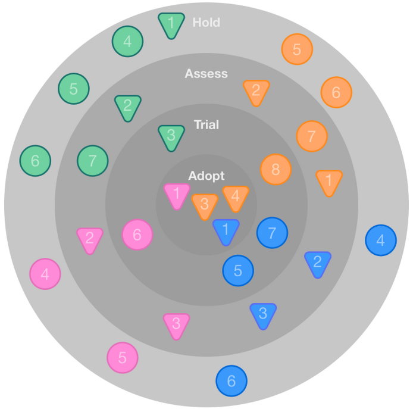

!SLIDE

# Ein kleiner   LEAN Methoden-Koffer #

~~~SECTION:notes~~~

* Die folgenden Slides zeigen ein paar Methoden aus dem Lean Management
* Vergleiche: Patterns aus der Software-Entwicklung

~~~ENDSECTION~~~

!SLIDE

# LEAN Methoden  a.k.a. Patterns #

<ul class="non-bullet">
    <li><strong class="rounded red">P</strong> Problemstellung</li>
    <li><strong class="rounded blue">T</strong> Tool</li>
    <li><strong class="rounded green">B</strong> Beispiel(e)</li>
</ul>

!SLIDE

# <strong class="red">P</strong> Umgang mit  Unsicherheit & Risiko #

* Unser Umfeld ist geprägt von
  * (zu) vielen Optionen
  * ständig neuen Technologien
  * hoher Unsicherheit
* Wir müssen in diesem Umfeld effizient sein
  * Wettbewerbsfähigkeit == Innovation?

~~~SECTION:notes~~~

* Klären, wie der Innovationsbegriff zu verstehen ist
* Verbesserung ggf. ≠ Innovation
  * Weil es das, was man am Ende macht ggf. schon gegeben hat, man es nur noch nicht eingesetzt hat

~~~ENDSECTION~~~

!SLIDE

# <strong class="blue">T</strong> Build-Measure-Learn   Feedback-Loop  (BML)#

!SLIDE

# <strong class="blue">T</strong> Build-Measure-Learn (BML)   Feedback-Loop #

* Arbeiten in kleinen, iterativen Zyklen

* Ziele:
  * Lernen durch Feedback
  * Validiertes Lernen, basierend auf Daten
  * Waste minimieren
  * Taktzahl erhöhen

~~~SECTION:notes~~~

* Startups: Wieviele Durchläufe, bis Geld aufgebraucht
* Entwicklung: Wieviele Durchläufe, bis Budget aufgebraucht

~~~ENDSECTION~~~

!SLIDE

# <strong class="green">B</strong> Continuous Integration Pipeline #

~~~SECTION:notes~~~

* Dieses Bild zeigt diverse Feedback-Loops in CI Pipeline
* Entwickler baut etwas

~~~ENDSECTION~~~

!SLIDE

# Wie kann  BML Feedback-Loop   umgesetzt werden? #

!SLIDE

# <strong class="red">P</strong> Wie erreicht man schnelle Feedbackzyklen? #

* Wie kann Feedback automatisiert werden?
* Wie bekommt man spezifisches Feedback?
* Wie schafft man mehr Durchläufe?

!SLIDE

# <strong class="blue">T</strong> Small Batches #

* Kanban / SCRUM
  * WIP Limits
  * Kein Queueing
  * Dinge zu Ende bringen

~~~SECTION:notes~~~

* CI / CD ist das Tool, um mit small Batches arbeiten zu können
  * Möglichkeit der "kostenfreien" Auslieferung kleiner Iterationen
  * Zahlreiche Möglichkeiten für Feedback (Tests, Code-Review, Kunden-Abnahmen)
* Einbeziehung von Kunden
  * Abnahme und Preview für Kunden
  * "Halbfertiges" ausliefern (siehe MVP)

~~~ENDSECTION~~~

!SLIDE

# <strong class="green">B</strong> Durchlaufzeiten am SCRUM Board

* SCRUM Board warnt vor Queueing

* Nur done ist done

!SLIDE

# <strong class="green">B</strong> Größe der Backlog-Items

* Kleine Tasks sind (meistens) effizienter

* Große Tasks verhindern schnelles Feedback

* Große Tasks zeigen oft hohes Risiko

* Risikominimierung durch Aufsplittung

!SLIDE

# <strong class="red">P</strong> Goldene Wasserhähne #

* "Über-Perfektion"
* "Übers-Ziel-Hinausschießen"
* "Dinge beim zweiten Mal richtig machen"

!SLIDE

# <strong class="blue">T</strong> Minimum Viable Product #

* Im Zweifelsfall: Dinge weglassen
* Schnelle Prototypen
  * Not-Invented-Here vermeiden
  * Fertige Tools nutzen
* "Minimal akzeptiertes Feature"
  * Wann ist ein Ticket umgesetzt?

~~~SECTION:notes~~~

* Beim Minimum Viable Product geht es darum, so schnell wie möglich rauszufinden, ob unser Produkt / Feature jemanden interessiert
* Dafür muss es gegebenenfalls noch nicht "perfekt aussehen" oder "performant" sein oder alle Sicherheitskriterien erfüllen

~~~ENDSECTION~~~

!SLIDE

# <strong class="green">B</strong> "Das neue Suchformular"

* Zu implementieren: Suche auf Webseite

* "Nice-to-have": Suche hat Auto-Complete
  * Verzögert Auslieferung
  * Läuft Gefahr, nicht gewollt zu sein

!SLIDE

# <strong class="red">P</strong> Ursachen beheben statt Symptome bekämpfen  #

* Gleiche Fehler tauchen immer wieder auf

* Dinge gehen nur manchmal

!SLIDE

#<strong class="blue">T</strong> The 5 WHYs #

* 5 Mal "Warum?" fragen

* "Root Cause Analysis"
  * Ursache des Problems finden

!SLIDE

#<strong class="green">B</strong> Kaputtes SSO

* Problem: SSO geht nicht
* 1. Warum: SSO Server liefert Schrott
* 2. Warum: Paket auf SSO Server fehlt
* 3. Warum: Server neu aufgesetzt
* 4. Warum: Spezifikation an Ops unklar
* 5. Warum: Dev und Ops Komm.-Problem

!SLIDE

# <strong class="red">P</strong> Bauchgefühl-entscheidungen

* "Ich bin der festen Überzeugung, dass..."

* "Meiner Meinung nach sollten wir..."

* "Das liegt vermutlich an..."

!SLIDE

# <strong class="blue">T</strong> Hypothesen-getriebene Experimente

* Experimente bestätigen / wiederlegen These

* Möglichst falisfizierbare Hypothesen

* Nutzung von Daten zur Bestätigung / Widerlegung von Hypothesen

!SLIDE

# <strong class="green">B</strong> Menü macht Seite lahm

* Beobachtung: 3000 DB Requests pro  Seitenaufruf für Menü-Rendering
* Hypothese: Macht Seitenaufbau lahm
* Experiment: Neues Caching
  * Performancetest vorher
  * Performancetest nachher
  * Tests mit realen Daten durchführen
* Ergebnis: 50% Beschleunigung

!SLIDE

# <strong class="red">P</strong> Wie messe ich den Erfolg von Maßnahmen

* Wie finde ich die richtigen Metriken?

* Wie interpretiere ich meine Metriken?

* Wie messe ich Verbesserungen?

* Welche Metriken helfen bei Entscheidungsfindung?

!SLIDE

# <strong class="blue">T</strong> Actionable Metrics #

* Metriken, aus denen sich Entscheidungen ableiten lassen: **Actionable Metrics**

* Metriken, die uns nicht bei Entscheidungsfindung helfen: **Vanity Metrics**

!SLIDE

# <strong class="green">B</strong> Actionable Metrics vs. Vanity Metrics

* Konversionsrate vs. Seitenaufrufe

* Aktivierungen vs. Downloads

* Durchlaufzeit vs. Story Points

* Fakturierte Stunden vs. Arbeitszeit

!SLIDE

# <strong class="green">B</strong> Pirate Metrics AARRR

<ul class="non-bullet">
<li><strong class="rounded">A</strong>cquisition &ndash; # Besucher</li>
<li><strong class="rounded">A</strong>ctivation &ndash; # glücklicher Besucher</li>
<li><strong class="rounded">R</strong>etention &ndash; # wiederkehrender Besucher</li>
<li><strong class="rounded">R</strong>evenue &ndash; # bezahlender Besucher</li>
<li><strong class="rounded">R</strong>eferral &ndash; # empfehlender Besucher</li>
</ul>

!SLIDE

# <strong class="red">P</strong> Innovation und Lernen transparent machen #

* Wie kann Innovation und Lernen "dokumentiert" werden?

* Wie kann ich darüber buchhalten?

!SLIDE

# <strong class="blue">T</strong> Innovation Radar

* Grafische Darstellung
  * Phasen der Adaption
  * Bewegung visualisieren
* WIP Limits vereinbaren

!SLIDE

# <strong class="green">B</strong> Beispiel für Innovation Radar

<table>
<tr>
<td></td>
<td></td>
</tr>
</table>

!SLIDE

# Methoden-Übersicht

* Build-Measure-Learn Loop
* MVP & Small Batches
* 5 WHYs
* Hypothesen-getriebene Experimente
* Actionable Metrics
* Innovation Radar
